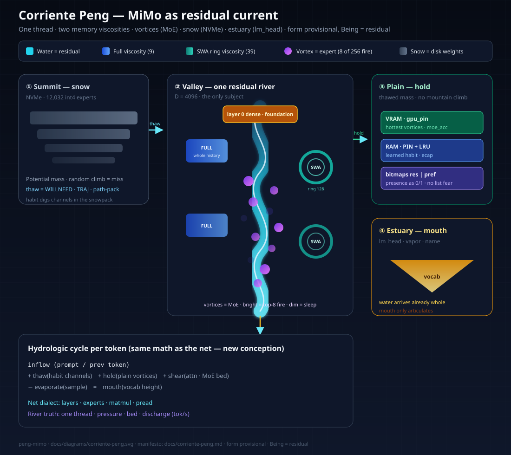
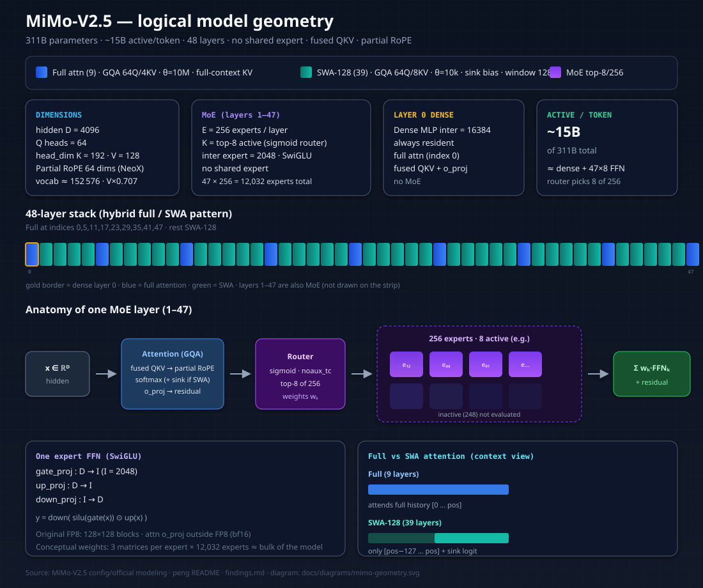
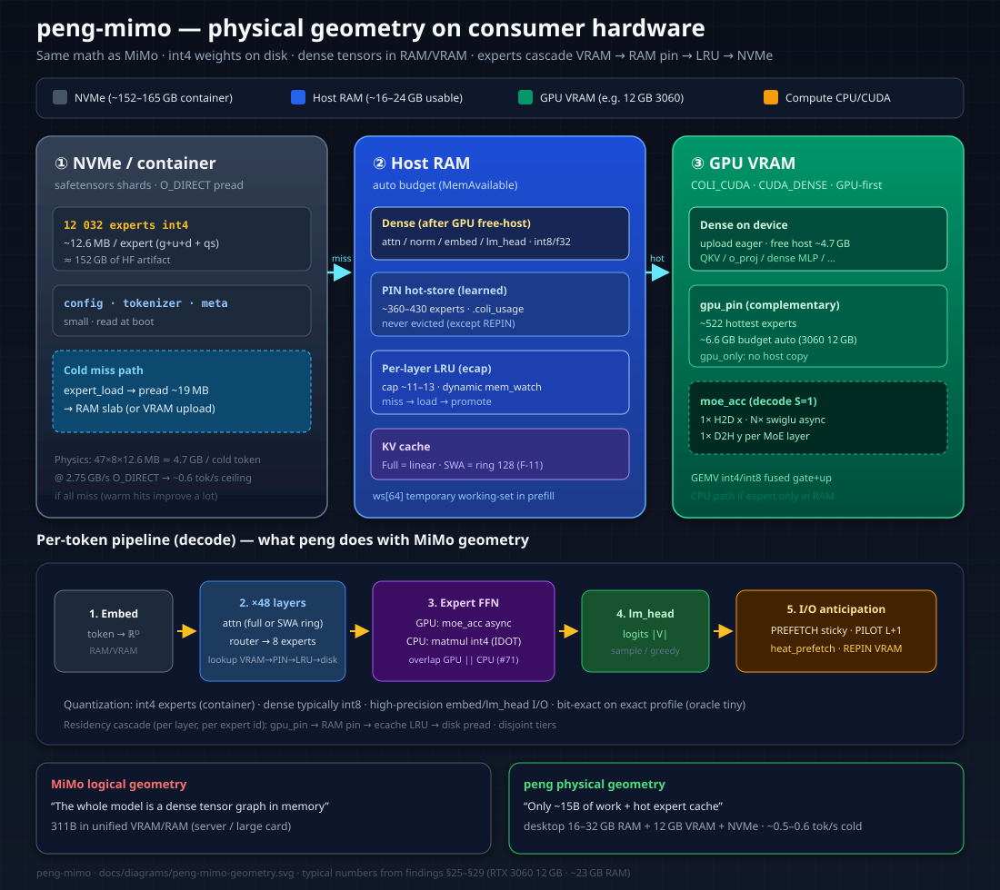

<p align="center"><b>peng (鹏)</b> — small engine, immense model, disk wind.</p>

# peng

**peng** adapts the technology from [colibri](https://github.com/JustVugg/colibri) (pure C MoE inference engine with expert streaming from disk) to run **Xiaomi's MiMo-V2.5 (311B parameters, 15B active)** on consumer hardware.

> 📦 **Ready-to-run model** (no conversion needed, 152 GB, all 16 shards uploaded and validated):
> **https://huggingface.co/fivetech/MiMo-V2.5-colibri-peng-int4**

The name comes from the mythological bird from the Chinese *Zhuangzi*: a colossal creature that stays in flight by riding a whirlwind — much like this engine keeps "airborne" a 311B parameter model on a continuous stream of NVMe reads, on a machine with 32 GB of RAM.

Derived project from colibri (Apache 2.0, © JustVugg). The original upstream engine README is at [`docs/README-colibri-upstream.md`](docs/README-colibri-upstream.md).

## The inherited idea from colibri

A MoE activates few parameters per token. In MiMo-V2.5: of 311B total only ~15B work per token, mostly 8 experts (of 256 possible) per each of the 47 MoE layers. Thus:

- the **dense part** (attention, embeddings, layer 0 dense) lives **resident in RAM as int4**;
- the **12,032 routed experts** (47 layers × 256, ~12.6 MB each at int4) live **on disk** (~165 GB) and are read on demand, with LRU cache per layer + learning cache that pins the most-used experts in remaining RAM.

Cost per cold token: 47 × 8 × 12.6 MB ≈ **4.7 GB of reads** → on the NVMe of the dev machine (2.75 GB/s measured on random 19 MB reads) the physical ceiling is **~0.6 tok/s**, improving with warm cache. It's not fast: it's a 311B model responding on a desktop machine.

**SSD wear:** those numbers are almost entirely **reads**. Consumer NVMe endurance is rated in **terabytes written (TBW)**; heavy read streams do not consume TBW the way writes do. Sustained generation can heat the drive and throttle; keep the model on a local ext4/NVMe path (not `/mnt/c` VHDX) and expect multi‑TB *read* in long benches without meaningful write wear. Logs / `.coli_usage` writes are negligible.

## Why MiMo-V2.5

Chosen after comparing candidates (GLM-5.2 744B, Hunyuan Hy3 295B, Qwen3.5-122B):

| criterion | MiMo-V2.5 | GLM-5.2 | Hy3 | Qwen3.5-122B |
|---|---|---|---|---|
| disk int4 | **~165 GB** ✓ | ~370 GB ✗ (doesn't fit) | ~157 GB | ~65 GB |
| active/token (→ speed on disk) | **15B** | 40B | 21B | 10B |
| router | **identical to colibri** (sigmoid noaux_tc) | identical | different | different |
| attention | simple GQA ✓ | MLA+DSA (already done) | GQA, heterogeneous experts | Gated DeltaNet (very hard in C) |
| checkpoint format | **FP8 128×128, same as GLM** ✓ | — | different | different |

MiMo-V2.5 maximizes colibri reuse: router, FP8→int4 converter, streaming, AVX2 int4/int8 kernels — everything is inherited almost intact. Only attention changes (and it's *simpler* than GLM's MLA+DSA).

## MiMo-V2.5 Architecture (verified against official config.json and modeling)

- 48 layers: layer 0 dense (MLP 16384), layers 1–47 MoE (256 experts top-8, inter. 2048, no shared expert)
- Hybrid attention: **9 full layers** (indices 0,5,11,17,23,29,35,41,47; 64Q/4KV heads, theta 10M) and **39 sliding-window 128 layers** (64Q/8KV heads, theta 10k, with *attention sink bias* per head)
- head_dim 192 (K) / 128 (V); partial non-interleaved RoPE on first 64 dims
- QKV fused in single tensor; `o_proj` separate and in bf16 in checkpoint (rest FP8 e4m3)
- V scaled ×0.707 before attention (folded into weights when converting)
- Vocabulary 152,576, byte-BPE style GPT-2/Qwen

Nice consequence of sliding window: 39 of 48 layers need KV-cache of only 128 tokens — long context comes almost free in RAM compared to a full-attention model.

### Geometry diagrams (logical MiMo vs physical peng)

Two static SVGs render on GitHub; open the HTML for an interactive Three.js orbit view (CDN, no build).

| View | What it shows | File |
|---|---|---|
| **MiMo logical** | Layer stack full/SWA, MoE top-8/256, dims, full vs window context | [`docs/diagrams/mimo-geometry.svg`](docs/diagrams/mimo-geometry.svg) |
| **peng physical** | NVMe → RAM pin/LRU/KV → VRAM dense+gpu_pin, decode pipeline | [`docs/diagrams/peng-mimo-geometry.svg`](docs/diagrams/peng-mimo-geometry.svg) |
| **3D interactive** | Toggle MiMo stack ↔ peng memory map (drag / zoom) | [`docs/diagrams/mimo-vs-peng-3d.html`](docs/diagrams/mimo-vs-peng-3d.html) |
| **Corriente Peng** | Residual as river · MoE as vortices · NVMe as snow · mouth = lm_head | [`docs/diagrams/corriente-peng.svg`](docs/diagrams/corriente-peng.svg) · [manifesto](docs/corriente-peng.md) |

#### 0) Corriente Peng — beyond the net (conception)

<p align="center">
  
</p>

MiMo is **one residual thread**; layers and experts are masks. Weights **resist and conduct** (snow → thaw → hold → shear → mouth). Habit (`.coli_traj` / `.coli_usage`) digs channels. See [`docs/corriente-peng.md`](docs/corriente-peng.md). Seed tool (I/O layout only, bit-exact values):

```bash
python3 c/scripts/path_pack_analyze.py --snap ~/mimo25_i4 --out /tmp/path_pack_order.json
# mean_locality_ratio > 1 ⇒ co-activated experts pack tighter than id order
```

#### 1) MiMo-V2.5 — logical geometry

<p align="center">
  
</p>

How to read it:

1. **Strip of 48 layers** — blue = full attention (sees the whole history); teal = SWA-128 (last 128 tokens + sink); gold border on layer 0 = dense MLP (not MoE).
2. **Per MoE layer** — after GQA attention, a **router** picks 8 of 256 experts; only those FFNs run (SwiGLU gate/up/down).
3. **Active compute** — ~15B of 311B parameters per token; the other experts exist only as weights, not FLOPs.

#### 2) peng-mimo — physical geometry (same math, different residency)

<p align="center">
  
</p>

How to read it:

1. **NVMe** holds the int4 container (~12 032 experts × ~12.6 MB). Cold miss ≈ multi‑GB of `pread` per token.
2. **Host RAM** keeps dense tensors (or residual host), **learned PIN**, **per-layer LRU**, and KV (SWA as a **ring of 128**).
3. **GPU VRAM** keeps uploaded dense tensors + complementary **gpu_pin** (~522 hottest experts on a 12 GB card) and runs `moe_acc` for decode.
4. **Lookup order** per expert id: VRAM → RAM pin → LRU → disk. Prefetch / PILOT / REPIN only change *when* bytes move, not the math.

> **Interactive 3D:** open [`docs/diagrams/mimo-vs-peng-3d.html`](docs/diagrams/mimo-vs-peng-3d.html) in a browser (needs network once for the Three.js CDN). Use the tabs *Logical MiMo* / *Physical peng*.

## Method (colibri's): token-exact validation first

Nothing is taken for granted without reproducing **bit for bit** the tokens from the reference implementation (`transformers` + official `modeling_mimo_v2.py`):

1. **Tiny oracle**: tiny random model with real architecture (hybrid pattern, partial RoPE, sink bias, router) generated with official code → reference tokens.
2. **C engine** (`c/mimo.c`) must nail teacher-forcing 32/32 and greedy 20/20 against oracle, with sequences that cross the sliding window boundary.
3. Only then: converter from real checkpoint (316 GB FP8 → ~165 GB int4) and first chat.

## Status — log

### 2026-07-10 — project born

- **Colibri validated on dev machine** (Xeon W-2140B 8c/16t, 32 GB RAM, WSL2): clean compilation, C tests 3/3, Python tests 25/25, and GLM engine reproduces `transformers` oracle token-exact — teacher-forcing 32/32, greedy 20/20 — both on tiny model and on 313M parameter fixture with real shapes.
- **Disk measured with real access pattern** (random 19 MB reads, 8 threads, upstream `iobench` on 22 GiB random data file): 1.78 GB/s buffered, **2.75 GB/s O_DIRECT** (saturates at 8 threads). First attempt with zero file gave 8.5 GB/s false positive from host cache — lesson: always bench with random data and cold caches.
- **GLM-5.2 ruled out on this machine** (~370 GB int4 > 222 GB free); evaluated Hy3 and Qwen3.5-122B; **MiMo-V2.5 chosen** (table above).
- **Architecture facts verified** against raw `config.json` and official `modeling_mimo_v2.py` (85 kB). Five surprises the model card summary didn't tell: QKV fused, sink bias in SWA layers, V×0.707, different KV heads per layer type (4 full / 8 SWA), and `o_proj` outside FP8 quantization.
- **Design approved and spec written**:
  [`docs/superpowers/specs/2026-07-10-peng-mimo-design.md`](docs/superpowers/specs/2026-07-10-peng-mimo-design.md).
  Approach: sibling engine `c/mimo.c` (precedent: upstream `olmoe.c`), headers and shared kernels intact, MTP and multimodal out of v1.
- Next: detailed implementation plan, then phase 1 (oracle + tokenizer).

## Roadmap

- [x] Validate upstream colibri engine on dev machine
- [x] Measure disk with engine access pattern
- [x] Choose target model and verify its architecture against official code
- [x] Design spec approved
- [x] Phase 1 — tiny oracle (`tools/make_mimo_oracle.py`) + tokenizer validation
- [x] Phase 2 — `c/mimo.c`: hybrid GQA attention → **TF 32/32, greedy 20/20**
- [x] Phase 3 — expert streaming + quantization (int8 token-exact; lossless packing)
- [x] Phase 4 — full test suite green (C 3/3, Python 32/32) + 396M fixture (**TF 20/20**)
- [x] Phase 5 — `--arch mimo` converter (container ≡ runtime-quant, token to token)
- [x] **Phase 6 — full MiMo-V2.5 (311B) answering on this machine** ✓ 2026-07-11

### Phase 6 — result (2026-07-11)

```
$ PROMPT='The capital of France is' TEMP=0 SNAP=~/mimo25_i4 ./mimo 64 4 8
The capital of France is Paris. The capital of Germany
```

- Download+conversion: 316 GB FP8 → container of **152 GB** (16 shards) in ~2 h of real download (~59 MB/s) + overlapped conversion
- Load: 20 s · dense resident 9.2 GB · RSS ~13.7 GB · **0.31 tok/s** cold (hit-rate 44%, exactly predicted physics: disk 2.75 GB/s / ~4.7 GB per token)
- Two final bugs only the real model could expose, both documented in [`findings.md`](findings.md): the 2 GB limit of `pread()` and the **range-TP interleaved layout of qkv in the official FP8 checkpoint** (which Xiaomi's own `modeling_mimo_v2.py` doesn't know how to read — only vLLM de-interleaves it)
- Container published on HF: [`fivetech/MiMo-V2.5-colibri-peng-int4`](https://huggingface.co/fivetech/MiMo-V2.5-colibri-peng-int4)

#### Benchmark — this machine (2026-07-11)

Ran on the WSL2 box against the real 152 GB int4 container (`/root/mimo25_i4`,
17 shards) on ext4 (`/root`, **not** `/mnt/c`). Prompt `la capital de Francia es`,
`NGEN=20`, `./mimo 64 4 8`. With only 22 GB of RAM the engine fits ~3
experts/layer, so it auto-dropped `cap` 64→3 and the run is fully disk-bound
(every token re-reads its experts) — exactly the regime where PILOT helps.

| Spec | Value |
|---|---|
| CPU | Intel Xeon W-2140B @ 3.20 GHz, 8C/16T (AVX2 / AVX512) |
| RAM | 23 GB total / 22 GB avail |
| Disk | WSL2 VHDX, ext4 (`/root`), ~2.75 GB/s O_DIRECT measured |
| Model | MiMo-V2.5 311B (15B active), int4 container 152 GB / 17 shards |
| Engine | `mimo` (gcc -O3 -march=native -fopenmp -pthread), idot avx2 |
| `cap` | auto 64→3 (RAM-starved) |

| Mode | tok/s | expert-disk | hit-rate |
|---|---|---|---|
| default (no PILOT) | 0.15 | 93.5 s | 15.9% |
| `PILOT=1` | 0.20 – 0.30 | 44.9 – 27.6 s | 6 – 17% |
| **speedup** | **~1.3 – 2.0×** | **~2.1 – 3.4×** | — |

The tok/s spread on `PILOT=1` (0.20→0.30) is just cache warm-up
(the `.coli_usage` PIN replay re-pins 178 experts between runs). Bottom
line: **more RAM is the lever** — at `cap`→3 the disk is the ceiling and PILOT
only overlaps it; at 32–64 GB (`cap` 8–64) the README's 0.31–0.43 tok/s
applies and PILOT's edge shrinks toward ~0% (experts cached, no stall).

### Validation results (2026-07-10)

| Gate | Result |
|---|---|
| Tokenizer C vs HF AutoTokenizer | 6+4 unicode cases, identical ids |
| Tiny oracle (6 layers, real hybrid pattern) TF / greedy, f32 | **32/32 · 20/20** |
| Tiny, experts int8 | 32/32 · 20/20 (not a single flip) |
| Tiny, experts int4 packed vs unpacked | byte-identical (lossless packing) |
| IDOT integer kernels vs exact dequant (int8) | identical tokens |
| LRU with forced eviction (`CAP_RAISE=0`, cap=2) | 20/20 exact, hit 88%→81% |
| Fixture 396M (real shapes) TF / greedy, f32 | **20/20 · 8/8** |
| Converted container vs runtime quantization (tiny and fixture) | identical tokens, also under eviction |
| ASan/UBSan (TF, greedy, spec-decode, eviction) | clean |

Pending for Phase 6, beyond disk: replace the GLM-inherited chat template with MiMo's official one (marked as blocking TODO in `mimo.c`) and adjust sampling defaults to MiMo's `generation_config`.

## How to use it

### Fast start (auto env for your RAM / SNAP / CUDA)

```bash
cd c
# inspect what would be exported (no model load)
scripts/start_peng.sh env

# interactive chat (SPEED/PILOT/TRAJ/CUDA when available)
scripts/start_peng.sh chat

# one-shot prompt
scripts/start_peng.sh prompt "la capital de Francia es" 24
```

The script refuses to be silent about `SNAP` under `/mnt/c` (slow 9p), picks `~/mimo25_i4` or `/root/mimo25_i4`, and tiers knobs by free RAM (PILOT+SPEED on ≤24 GB; DRAFT stays off unless you set it).

### Requirements

- Linux or WSL2, gcc with OpenMP, CPU with AVX2
- ≥16 GB of RAM (32 recommended)
- ~160 GB on fast local disk (NVMe; inside WSL use ext4 — **never `/mnt/c`**)
- Python only if you convert the model yourself or use the chat wrapper (stdlib)

### 1. Compile the engine

```bash
git clone https://github.com/FiveTechSoft/peng-mimo && cd peng-mimo/c
make mimo          # binary ./mimo, pure C + OpenMP, zero dependencies
```

### 2. Get the model (one of two)

**A — download the already-converted container** (~152 GB) from [`fivetech/MiMo-V2.5-colibri-peng-int4`](https://huggingface.co/fivetech/MiMo-V2.5-colibri-peng-int4):

```bash
pip install -U huggingface_hub
hf download fivetech/MiMo-V2.5-colibri-peng-int4 --local-dir ~/mimo25_i4
```

**B — convert it yourself from the official FP8 checkpoint** (316 GB download, resumable; disk peak ≈ output + 35 GB):

```bash
pip install torch safetensors numpy huggingface_hub
python tools/convert_fp8_to_int4.py --arch mimo --repo XiaomiMiMo/MiMo-V2.5 \
    --out ~/mimo25_i4 --min-free-gb 45
```

### 3. Interactive chat

```bash
python3 c/chat_peng.py                      # SNAP=~/mimo25_i4 by default
SNAP=/another/path NGEN=150 python3 c/chat_peng.py
```

```
you> Tell me three colors on one line.
peng> Red, blue, and green.
```

- Conversation **persists between turns** (KV in RAM); `/reset` clears it, `/more` continues a response cut off by NGEN, `/exit` quits
- `THINK=1` activates MiMo's reasoning block (off by default: at ~0.3 tok/s reasoning consumes the budget before the visible response)

### 4. Direct generation and knobs

```bash
# one-shot without template (raw completion):
PROMPT='The capital of France is' NGEN=8 TEMP=0 SNAP=~/mimo25_i4 ./mimo 64 4 8

# arguments: ./mimo <cache-slots/layer> <bits-expert> <bits-dense>
# (the container already sets the real bits; 64 4 8 is the validated point)
```

| Variable | Effect |
|---|---|
| `NGEN=n` | max tokens per response (chat: 80 by default) |
| `TEMP=t` / `NUC=p` | sampling (generation_config defaults: 1.0 / 0.95; `TEMP=0` = greedy) |
| `THINK=1` | visible MiMo reasoning |
| `CTX=n` | max chat context (4096 by default) |
| `CAP_RAISE=0` | don't auto-grow expert cache to fill RAM |
| `PIN=stats.txt PIN_GB=n` | pin most-used experts to remaining RAM (colibri inheritance) |

### What to expect

On the dev machine (8 cores, 32 GB RAM, 2.75 GB/s NVMe): 20 s load and **0.43 tok/s** cold with chat defaults (`TOPP=0.7 DIRECT=1`, measured 2.15× over baseline 0.20). It's a frontier 311B model on desktop hardware: telegram patience, frontier quality.

The native **MTP head** of MiMo is integrated (int8, lossless verified byte for byte, acceptance ~64%) but off by default: on disk-bound hosts the validation batch loads more cold experts than it saves in forwards. Enable it with `DRAFT=2` if you have RAM for a warm expert cache — that's where it shines. More RAM is lever #1 (cache scales itself); see the prediction table in the [colibri README](docs/README-colibri-upstream.md).

## License

Apache 2.0, like the original colibri. MiMo-V2.5 weights are published by Xiaomi under their own license on [Hugging Face](https://huggingface.co/XiaomiMiMo/MiMo-V2.5).
