# peng — illustrated tour

Fourteen conceptual infographics covering the whole project, generated from the
project docs (findings.md, roadmap.md, README). Numbers shown match the measured
sections they cite unless noted.

## The idea

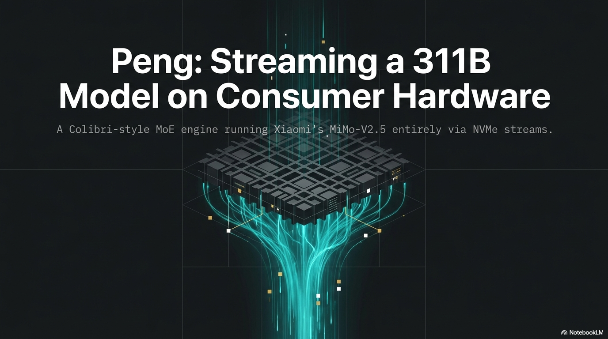

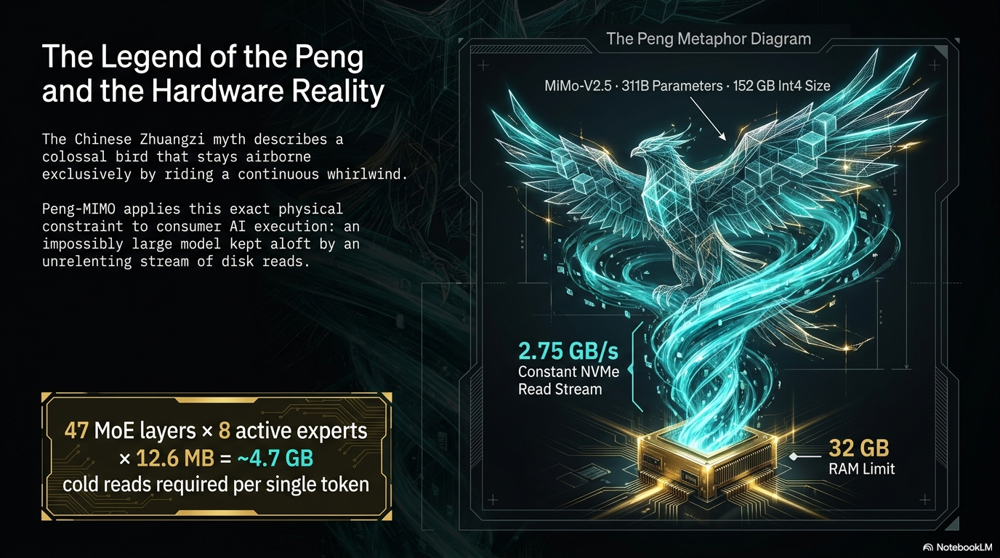

## Architecture

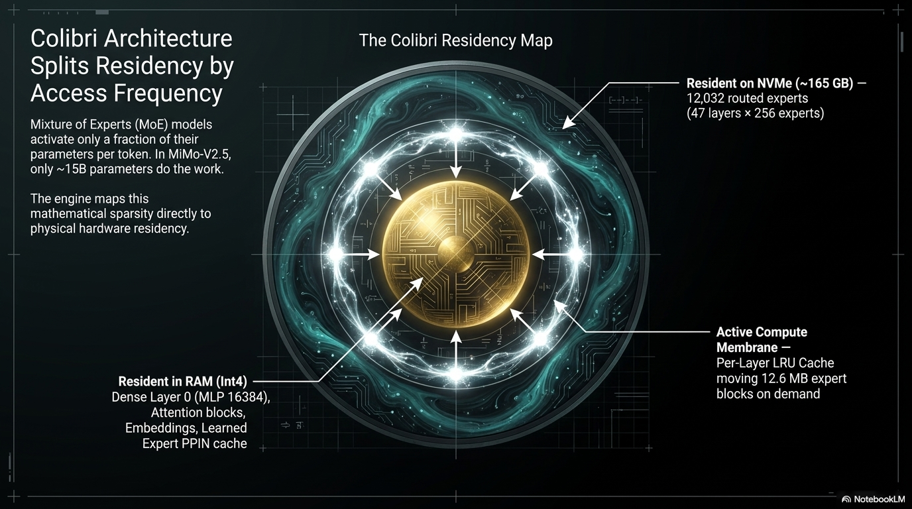

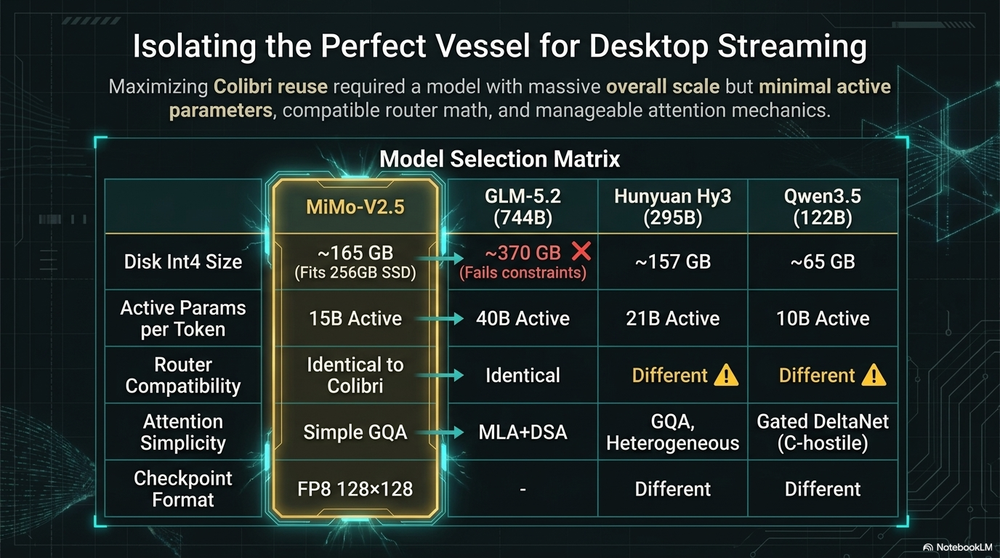

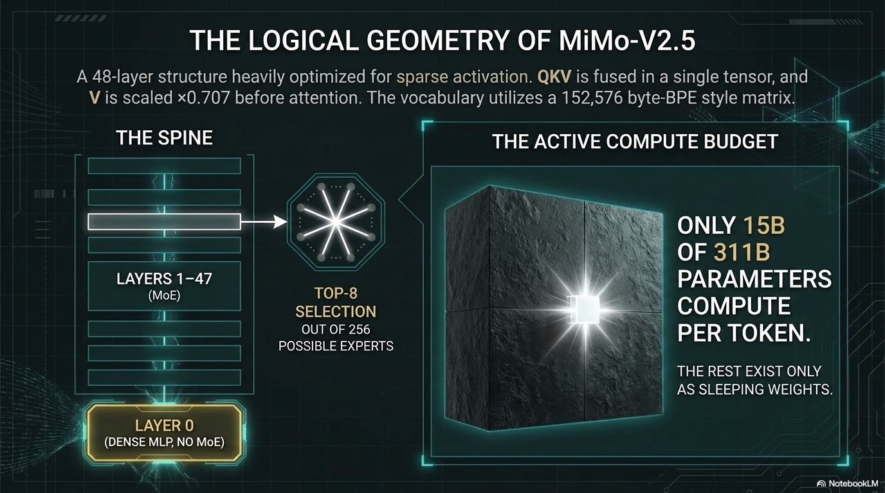

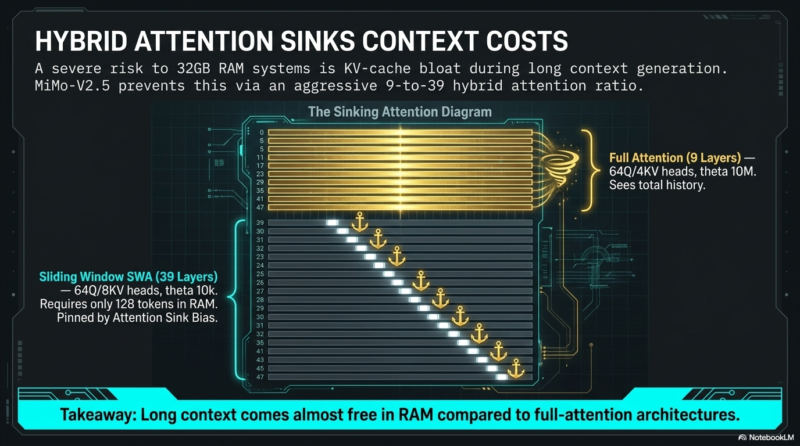

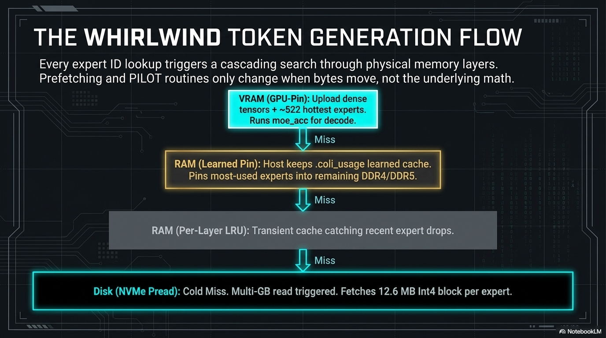

## Correctness before speed

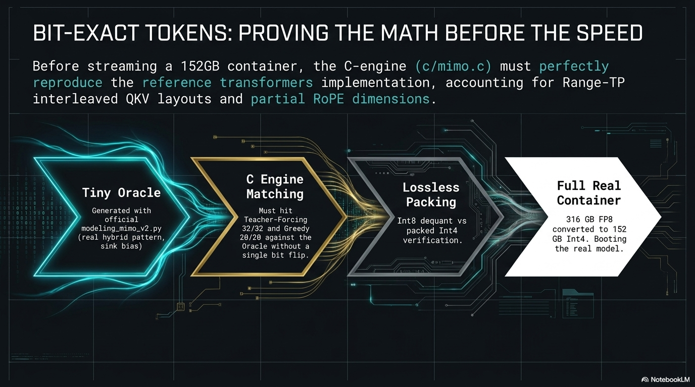

## Performance

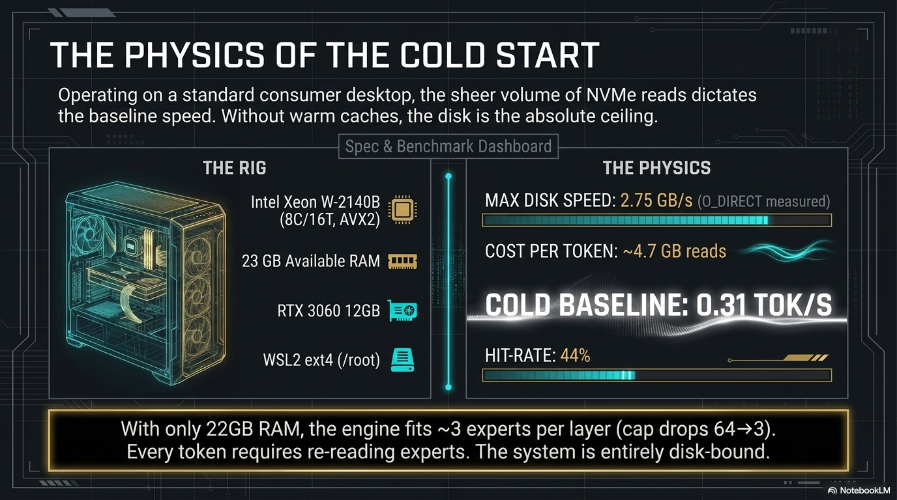

> Note: two details in this panel don't match findings.md — the measured RAM-starved
> cap reduction was 64→22 slots (not 64→3), and the rig CPU spec shown is illustrative.

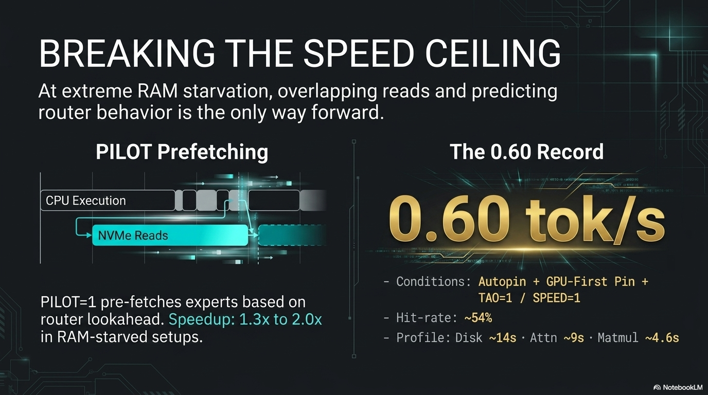

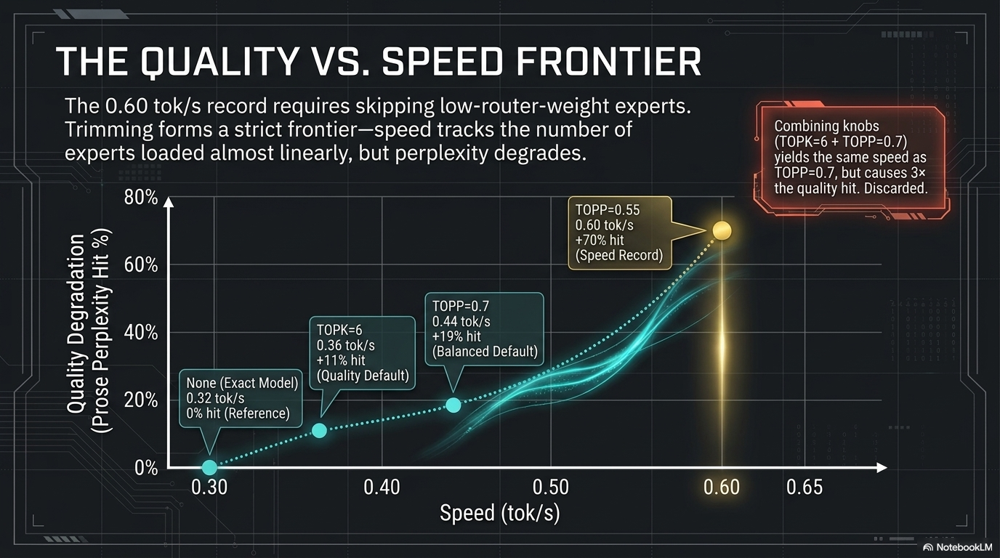

## Operations

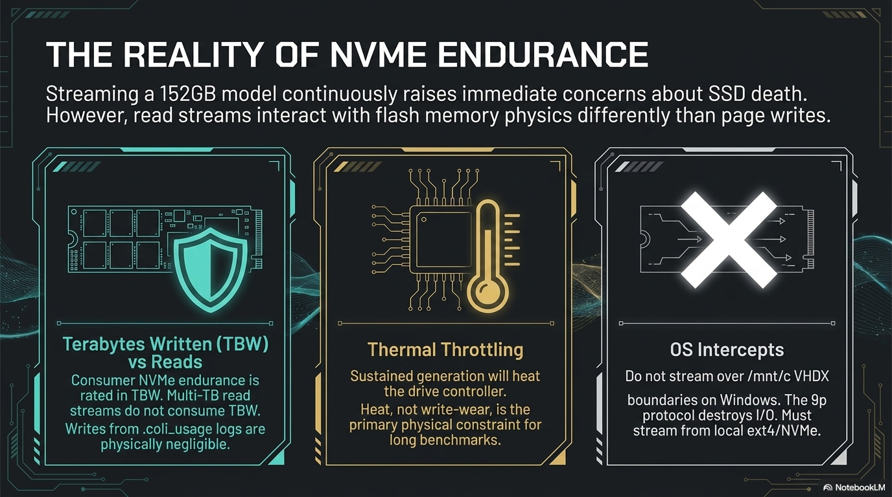

## Philosophy

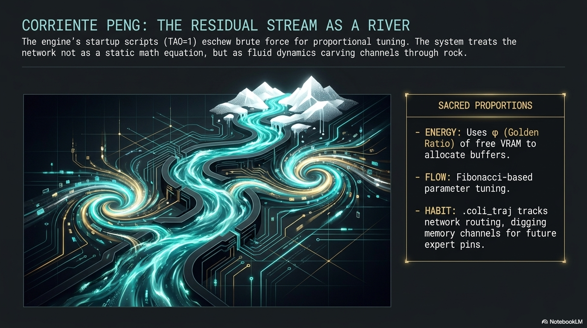

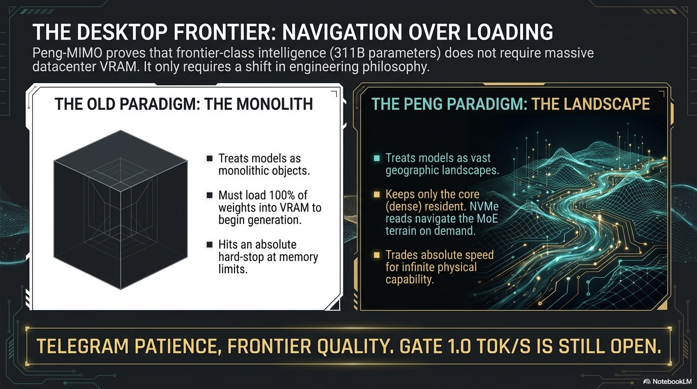
